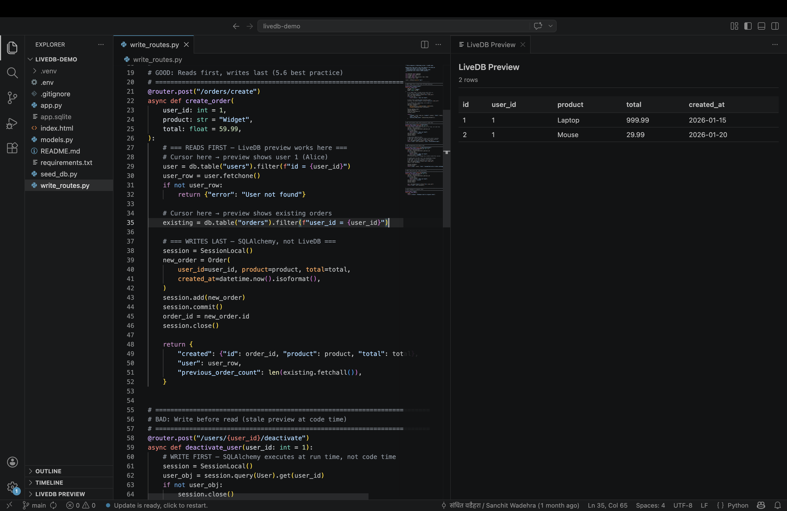

# LiveDB Demo

A FastAPI app to try [LiveDB](https://github.com/sanchitwadehra/LiveDB) — open in VS Code, move your cursor through the code, see real data from the database. No need to run the app.



Open any file, place your cursor on a LiveDB expression, and see the query results instantly.

## Quick Start

```bash
git clone https://github.com/sanchitwadehra/livedb-demo.git
cd livedb-demo
python -m venv .venv && source .venv/bin/activate
pip install -r requirements.txt
python seed_db.py
```

**See previews:** Open the folder in VS Code (with the LiveDB extension installed), then open `app.py` and place your cursor on any LiveDB expression.

**Run the API:** `uvicorn app:app --reload` → open http://localhost:8000

## What's Inside

| File | Purpose |
|------|---------|
| `app.py` | FastAPI read endpoints using LiveDB — previews work on all LiveDB expressions |
| `write_routes.py` | SQLAlchemy write endpoints — demonstrates code-time vs run-time behavior |
| `models.py` | SQLAlchemy models (User, Order) |
| `seed_db.py` | Seeds the SQLite database with sample data |
| `index.html` | Frontend to test all endpoints interactively |

## How It Works

- **Reads:** LiveDB (via DuckDB's sqlite_scanner) — get live previews while coding
- **Writes:** SQLAlchemy (direct SQLite connection) — standard ORM for mutations
- **Same database, two connections, no conflicts**

## Requirements

- Python 3.10+
- VS Code with [LiveDB extension](https://marketplace.visualstudio.com/items?itemName=sanchitwadehra.livedb-vscode)
